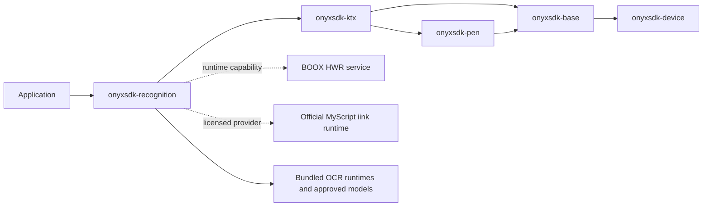

# Legacy recognition module implementation plan

<!-- markdownlint-disable MD013 -->

> **Superseded:** This proposal is retained for historical context. The authoritative
> implementation blueprint is
> [`docs/RECOGNITION_MODULE_IMPLEMENTATION_PLAN.md`](docs/RECOGNITION_MODULE_IMPLEMENTATION_PLAN.md).
> In particular, the authoritative plan removes the BOOX Binder provider, includes
> speech, separates the native cores, and replaces the unresolved decisions below.

## Document status

This document is an implementation plan, not an implementation. It proposes a new
additive Android library named `onyxsdk-recognition` for local handwriting and image
recognition. No source code, model, native library, Android component, permission, or
runtime dependency described here is added by this document.

The working Maven coordinate is:

```text
io.github.hbmartin.onyx:onyxsdk-recognition:0.1.0
```

The name and initial version become final only after the Phase 0 licensing and
feasibility gates pass.

## Decision summary

The proposed module will:

- convert immutable pen strokes into text and ranked alternatives;
- expose the compatible BOOX firmware handwriting service as a capability-probed,
  local provider;
- support a direct, on-device MyScript iink provider when the application supplies
  an officially licensed runtime, certificate, and recognition assets;
- perform OCR locally, with all required runtime code and models installed before
  recognition begins;
- return structured blocks, lines, elements, symbols, bounds, languages, confidence,
  and model provenance where the underlying engine provides them;
- use the existing `onyxsdk-ktx` immutable ink contracts instead of introducing a
  second stroke model;
- perform no cloud fallback and request no network permission; and
- preserve the clean-room boundary: firmware-extracted binaries and resources remain
  analysis evidence and never become source, build inputs, test fixtures, or release
  contents.

The document also describes four adjacent features without placing them in the
implementation backlog:

- ink search;
- keyboard handwriting;
- Google Speech SODA; and
- Qualcomm Voice Activation.

## Scope

### In scope for implementation

| Capability | Required outcome |
| --- | --- |
| Handwriting-to-text | Accept completed or streamed `InkStroke` values and return text, alternatives, bounds, language, and provider provenance. |
| Built-in recognition | Discover and safely bind the BOOX system HWR service when an ordinary application is allowed to use it. Report unsupported or inaccessible firmware honestly. |
| Direct MyScript recognition | Integrate the official on-device iink runtime for text, math, shapes/diagrams, and raw-content analysis without redistributing extracted firmware files. |
| Full local OCR | Recognize the agreed script set with bundled or application-installed local models; processing must continue with networking disabled. |
| Resource management | Validate, install, select, version, and roll back licensed recognition packs in application-private storage. |
| Capability and diagnostics API | Explain which provider, language, content type, and model are usable and why. Never infer support solely from a class or file name. |
| Verification | Unit, contract, golden-corpus, adversarial, offline, performance, and BOOX device validation. |

### Described but explicitly not implemented

The following subjects receive architecture notes later in this document so that the
recognition result contracts do not preclude them. They are not deliverables, phases,
Gradle dependencies, permissions, manifests, services, user interfaces, or acceptance
criteria for `onyxsdk-recognition` 0.1.0.

| Capability | Explicit boundary |
| --- | --- |
| Ink search | No index, database schema, background indexer, query parser, ranking, or search UI. |
| Keyboard handwriting | No `InputMethodService`, keyboard UI, candidate strip, vocabulary manager, or IME lifecycle integration. |
| Google Speech SODA | No audio capture, speech API wrapper, speech model download, `RECORD_AUDIO`, or recognition-service manifest entry. |
| Qualcomm Voice Activation | No hotword service, DSP session, vendor JNI, privileged permission, sound model, or microphone ownership. |

### Out of scope

- cloud handwriting, OCR, speech, or generative-AI providers;
- automatic network fallback of any kind;
- large-language-model inference, summarization, or meeting insights;
- note persistence, synchronization, editing, or rendering UI;
- camera capture and PDF rendering; callers provide an image or rendered page;
- handwriting author identification, biometric inference, or authentication;
- training or fine-tuning recognition models in the Android library;
- extraction or redistribution of BOOX, Google-internal, Qualcomm, or MyScript
  firmware artifacts; and
- changes to the public ABI of the recovered `base`, `device`, or `pen` compatibility
  modules.

## Definitions and behavioral promises

### “Local” and “offline”

Local recognition means that input bytes and strokes are processed in the application
process or by a trusted on-device system service. A provider is not local if it sends
input, features, embeddings, diagnostics containing content, or results over a network.

The initial release must satisfy all of these invariants:

1. The recognition AAR does not declare `android.permission.INTERNET`.
2. Recognition succeeds after all declared resources are installed while networking is
   blocked at the device and process levels.
3. No provider silently changes from local to remote processing.
4. A missing local model produces `ModelUnavailable`, not a download or cloud request.
5. Diagnostic records contain sizes, durations, provider IDs, and failure categories,
   but never raw ink points, images, recognized text, certificates, or user vocabulary.

### “Built-in recognition”

Built-in recognition means the BOOX firmware-owned HWR service and the recognition
resources already installed in the system image. It does not mean that the new AAR
contains proprietary recognition engines. This provider is optional at runtime because
firmware version, package visibility, signatures, and permissions may prevent a normal
third-party application from binding it.

### “Direct MyScript recognition”

Direct MyScript recognition means the consuming application is licensed to run the
official on-device MyScript iink SDK and supplies its application-specific certificate
and official recognition packs. It is distinct from calling the BOOX firmware service,
even when that service internally uses MyScript technology.

### “Full local OCR”

For version 0.1.0, full local OCR means:

- text detection, orientation, script routing, recognition, and structured result
  assembly all run locally;
- Latin, Chinese, Japanese, Korean, Devanagari, and Bengali inputs are covered, matching
  the script families observed in the investigated firmware;
- mixed-script pages are either routed automatically or accepted through an explicit
  script hint;
- callers receive blocks, lines, elements, symbols when available, bounding geometry,
  detected language or script, confidence where meaningful, and the model version; and
- models required for a declared capability are bundled in the application or installed
  explicitly from caller-supplied, integrity-checked bytes before use.

“Full” does not mean every written language or unconstrained document understanding.
Additional scripts are future resource packs and must not be reported as supported until
they pass the same accuracy and offline gates.

## Firmware-derived compatibility baseline

The Note Air4 C 4.2 firmware investigation is behavioral evidence, not a source of
redistributable code. The relevant observations are:

| Firmware evidence | Design implication |
| --- | --- |
| Native raw pen capture, pressure, eraser state, region filtering, and handwriting repaint are system-integrated. | Consume the stable `RawInkSession`/`InkStroke` façade; do not duplicate the firmware pen reader. |
| Kime sends pointer events through `HWRClientBatchRecognizeAction` to an `IHWRService` Binder service. | Implement a narrow, versioned firmware provider with capability probes and Binder-death handling. |
| Service names include `com.onyx.android.note.note.service.HWRService`, `KHwrService`, and `KCommonHwrService`. | Treat component discovery as firmware-profile data, not a single hard-coded assumption. |
| `/system/lib64` contains `libiink.so`, MyScript component libraries, and `libMyScriptMLOrt.so`. | The system provider is genuinely local, but those libraries must not be copied into this repository or AAR. |
| `/system/recognition_assets` contains English, Simplified Chinese, math, diagram, shape, and raw-content configurations/resources. | Base firmware capability probing should distinguish text languages from math/diagram content types. |
| The firmware defines downloadable HWR resources and `.noteResource/additional_res`. | The new module needs a safe resource-pack abstraction, but it must not reuse unsafe shared-storage conventions. |
| NeoReader contains local TFLite/ML Kit-style OCR assets and Paddle-style Chinese `.nb` models. | Reproduce the capability through supported, licensed public dependencies and models, never by extracting those assets. |
| Google Speech Services contains on-device, hybrid, and network recognizer paths; SODA language packs are downloaded separately. | Document speech as a future integration, separate from the local handwriting/OCR module. |
| Qualcomm Voice Activation contains neural keyword-spotting libraries and privileged hotword permissions. | Document capability discovery only; do not bundle or invoke vendor libraries. |

See [the firmware investigation](docs/FIRMWARE_NOTEAIR4C_4_2.md),
[the KTX façade](onyxsdk-ktx/README.md), and
[stroke compatibility](docs/STROKE_COMPATIBILITY.md) for the existing evidence and ink
contracts.

## Repository and build integration

### Module placement

The proposed production directory is:

```text
onyxsdk-recognition/
├── build.gradle.kts
├── consumer-rules.pro
├── README.md
└── src/
    ├── main/
    │   ├── AndroidManifest.xml
    │   ├── java/com/onyx/android/sdk/recognition/
    │   └── assets/recognition/        # only approved redistributable assets
    ├── test/
    └── androidTest/
```

The module is additive. It must be registered once in
`gradle/onyx-modules.json`, allowing the existing settings plugin, package-ownership
checks, publication metadata, aggregate assembly, and verification tasks to discover
it. Proposed registry properties are:

```text
id             = recognition
projectPath    = :onyxsdk-recognition
artifactId     = onyxsdk-recognition
version        = 0.1.0
published      = true, subject to Phase 0 licensing approval
ownedPackages  = com.onyx.android.sdk.recognition and its subpackages
```

### Dependency direction



`onyxsdk-recognition` should use `api(project(":onyxsdk-ktx"))` only because its
handwriting API deliberately accepts the immutable KTX `InkStroke` type. OCR and
provider implementation dependencies remain `implementation`. No existing recovered
compatibility module gains a dependency on recognition.

Public coroutine types follow the KTX conventions: Coroutines Core is an API dependency,
Coroutines Android is internal, cancellation is rethrown, and non-cancellation failures
are returned as typed `Result` failures. RxJava, EventBus, MyScript types, ML runtime
types, and Binder interfaces must not leak into public signatures.

### Proprietary provider packaging

The open AAR must remain reproducible without proprietary artifacts. Phase 0 must select
one of these approved topologies:

1. **Preferred:** `onyxsdk-recognition` contains the provider SPI, firmware provider,
   and OCR implementation; a separately licensed `onyxsdk-recognition-myscript`
   companion artifact contains the typed iink adapter.
2. **Acceptable when the official SDK supports it:** the MyScript adapter lives in the
   main module but declares an official, consumer-resolvable compile/runtime dependency
   and packages no MyScript binary, certificate, or recognition resource.
3. **Fallback:** the main module exposes a typed, vendor-neutral provider SPI and a
   private integrator-owned adapter implements it outside this repository.

Runtime reflection over arbitrary MyScript versions and checked-in stub MyScript APIs
are rejected: both approaches hide compatibility errors and make the published API
misleading.

## Proposed public architecture

### Packages

| Package | Responsibility |
| --- | --- |
| `recognition` | Entry point, lifecycle, backend policy, capabilities, shared failures. |
| `recognition.handwriting` | Stroke sessions, options, candidates, text/math/diagram results. |
| `recognition.ocr` | Image input, script selection, page hierarchy, OCR provider API. |
| `recognition.model` | Immutable shared DTOs, geometry, locale/script, provenance. |
| `recognition.provider` | Internal/provider SPI and provider selection. |
| `recognition.provider.firmware` | BOOX HWR Binder discovery, protocol, conversion, recovery. |
| `recognition.provider.myscript` | Licensed iink integration when the selected packaging topology allows it. |
| `recognition.provider.ocr` | Bundled OCR backends, preprocessing, routing, result normalization. |
| `recognition.resources` | Pack manifests, installation, hashes, compatibility, rollback. |
| `recognition.diagnostics` | Bounded, content-free events and benchmark receipts. |

### Entry points

The following is an API-shape sketch, not source to copy verbatim:

```kotlin
interface RecognitionSdk : AutoCloseable {
    suspend fun capabilities(
        probeMode: RecognitionProbeMode = RecognitionProbeMode.PASSIVE,
    ): Result<RecognitionCapabilities>

    suspend fun openHandwritingSession(
        options: HandwritingOptions,
    ): Result<HandwritingSession>

    suspend fun recognizeImage(
        image: OcrImage,
        options: OcrOptions = OcrOptions(),
    ): Result<OcrDocument>
}

interface HandwritingSession : AutoCloseable {
    val state: StateFlow<HandwritingState>
    suspend fun append(stroke: InkStroke): Result<Unit>
    suspend fun recognize(final: Boolean = false): Result<HandwritingResult>
    suspend fun reset(): Result<Unit>
}
```

The real API should also provide a Java-friendly callback/task façade or generated JVM
overloads. It must not expose suspend-only functionality without a documented Java path.

### Core input models

Handwriting consumes `com.onyx.android.sdk.ktx.model.InkStroke`, preserving:

- view-local physical-pixel coordinates;
- monotonic nanosecond timestamps;
- normalized and raw pressure;
- tilt axes;
- point sequence numbers and coalescing gaps; and
- explicit pen, side-eraser, and tail-eraser tools.

`HandwritingViewport` supplies width, height, DPI, rotation, coordinate transform, and
writing direction. Provider adapters copy and normalize inputs; they never mutate the
caller's strokes.

OCR accepts an ownership-explicit `OcrImage` variant:

- immutable/copy-owned `Bitmap`;
- `Image`/plane input valid for the duration of a call;
- read-only `ByteBuffer` with width, height, stride, format, and rotation; or
- encoded image bytes subject to strict size and decoder limits.

The first release does not accept arbitrary file paths or URLs. This prevents confused
ownership, path traversal, and hidden I/O.

### Result models

`HandwritingResult` should be a sealed hierarchy:

- `HandwritingText`: normalized text, word/character bounds, selected candidate,
  alternatives, language, and writing-mode metadata;
- `HandwritingMath`: plain text where available, LaTeX, MathML, expression bounds, and
  provider-native export only when it is safe and documented;
- `HandwritingDiagram`: recognized nodes, edges, shapes, labels, and geometry;
- `HandwritingRawContent`: text/non-text blocks and layout; and
- `HandwritingNoMatch`: a successful recognition attempt with no acceptable candidate.

`OcrDocument` contains page dimensions and ordered `OcrBlock` → `OcrLine` →
`OcrElement` → `OcrSymbol` nodes. Every node can carry:

- text;
- axis-aligned bounds and optional corner points;
- confidence with an explicit `ConfidenceKind` because engine scores are not directly
  comparable;
- detected script/language;
- rotation or baseline information; and
- child nodes.

Every result includes `RecognitionProvenance`:

```text
provider ID
provider version
model/resource pack IDs and versions
content type and language/script
local-only assertion
input transform fingerprint
elapsed initialization and inference time
warnings and degraded capabilities
```

Provenance contains no device serial, content, certificate, absolute private path, or
stable user identifier.

### Capabilities and provider selection

Capabilities use `SUPPORTED`, `UNSUPPORTED`, and `UNVERIFIED`, consistent with the KTX
façade. A result records the evidence used: package resolution, safe Binder round trip,
licensed engine initialization, model hash verification, or successful local probe.

Selection is explicit through `RecognitionBackendPolicy`:

- `AUTO_LOCAL`: prefer a verified firmware provider on compatible BOOX hardware, then a
  licensed direct MyScript provider; never select cloud;
- `FIRMWARE_ONLY`;
- `MYSCRIPT_ONLY`;
- `OCR_BUNDLED_ONLY`; and
- `providerId(...)` for deterministic testing.

Provider switching is allowed only before a session starts or after reset. A session
never migrates midway because candidate ordering, coordinate interpretation, and
language behavior differ between engines.

### Failure model

Failures need stable categories and content-free diagnostics:

- `BackendUnavailable`;
- `BackendUnverified`;
- `PermissionDenied`;
- `BinderDied`;
- `LicenseMissing` or `LicenseRejected`;
- `ModelUnavailable`, `ModelIncompatible`, or `ModelIntegrityFailed`;
- `UnsupportedLanguage`, `UnsupportedScript`, or `UnsupportedContentType`;
- `InvalidStroke`, `InvalidImage`, or `InputTooLarge`;
- `RecognitionTimedOut`;
- `EngineInitializationFailed`;
- `EngineExecutionFailed`; and
- `ResourceLimitExceeded`.

Cancellation is not converted to any of these failures. Cleanup runs non-cancellably,
then `CancellationException` is rethrown.

## Handwriting-to-text pipeline

### Session state machine

```text
NEW -> INITIALIZING -> READY -> COLLECTING -> RECOGNIZING -> READY
                                 |               |
                                 +----reset------+
any non-closed state -> FAILED -> CLOSED
any non-closed state -----------> CLOSED
```

Only one operation mutates a session at a time. A serialized queue owns provider calls,
stroke accumulation, reset, and close. Recognition work runs off the main thread;
firmware binding and Android lifecycle calls move to the required thread internally.

### Stroke processing

1. Validate all values are finite, timestamps are monotonic within a stroke, and point
   counts and geometry are within configured limits.
2. Copy immutable input into a provider-neutral pointer-event buffer.
3. Apply viewport transform, rotation, DPI normalization, and provider coordinate
   convention exactly once.
4. Preserve stroke boundaries, tool type, and down/move/up ordering.
5. Optionally remove duplicate stationary points without changing semantic pen-up
   timing; retain the original point count in provenance.
6. Apply bounded batching. Never silently truncate an oversized stroke.
7. Invoke recognition after an explicit call or an opt-in debounce policy. A firmware-
   compatible default may begin at 500 ms after pen-up, but latency benchmarks must
   determine the final value.
8. Normalize results without inventing confidence values or alternatives the provider
   did not return.

Eraser strokes are not text input. The caller must resolve erasure against its document
model before sending the surviving strokes for recognition. Recognition may expose
gesture results only when a provider explicitly supports them and the caller enables
that content type.

### Streaming and incremental behavior

The first stable release must support batch recognition. Incremental results may be
added only after provider semantics are characterized. If exposed, previews are
latest-wins and may be dropped, while completed/final results are lossless. A final
result is tagged with the exact last accepted stroke sequence so a caller can reject a
stale response.

## Built-in BOOX firmware provider

### Feasibility gate

Before writing the provider, install a minimal unprivileged probe APK on the target
firmware and establish:

1. which HWR service component is exported;
2. whether package visibility or a signature permission blocks binding;
3. the stable Binder interface descriptor and protocol version;
4. whether a no-content capability call exists;
5. whether a tiny synthetic stroke round trip works without changing device data; and
6. whether service use triggers a license, account, or network dependency.

If an ordinary application cannot legally and reliably bind the service, the provider
remains `UNSUPPORTED` for public consumers. The implementation must not use privilege
escalation, shell identity, hidden package installation, system UID assumptions, or
signature spoofing.

### Provider responsibilities

- Resolve only allowlisted firmware-profile components.
- Verify that the target is a system application and record package/version/signature
  evidence without embedding a brittle single signature requirement.
- Bind with explicit intents and strict lifecycle ownership.
- Reconstruct only the minimal clean-room Binder contract required for input, result,
  cancel, and close.
- Place large request/result payloads in bounded memory files or file descriptors where
  the protocol requires it.
- Validate all returned JSON/protobuf lengths, nesting, strings, coordinates, and enum
  values before mapping them into public results.
- Register a death recipient, fail active work with `BinderDied`, and permit one bounded
  rebind for a later request.
- Keep firmware transaction IDs and component mappings in versioned profiles with
  evidence and tests.
- Never call firmware resource-download broadcasts from the local-only recognition path.

The provider must use passive discovery by default. An active recognition probe requires
an explicit `ACTIVE_REVERSIBLE` mode and synthetic, non-user content.

## Direct MyScript provider

### Licensing gate

No direct provider work starts until written license terms answer all of the following:

- May the adapter source be published under this repository's license?
- May a Maven POM reference the official iink artifacts?
- May the integration artifact itself be published publicly?
- Which ABIs and Android API levels are covered?
- May official recognition resources be bundled in an application or AAR?
- How must application-specific certificates be provisioned, rotated, and protected?
- Are automated CI, emulator, and device tests permitted?

Certificates, SDK archives, native libraries, and resource packs are secrets or licensed
inputs. They remain outside Git and are supplied by documented Gradle properties or a
consumer application. A sample build uses a fake provider, never a fake certificate.

### Provider behavior

The direct provider will:

1. instantiate the official engine with the consumer-supplied certificate;
2. load only approved standard or lite recognition configurations from an
   application-private or APK asset location;
3. expose text, math, shape/diagram, and raw-content capabilities independently;
4. map KTX strokes to official pointer events while preserving timing and tool type;
5. use recognizer/offscreen APIs for headless conversion rather than requiring an
   editor UI;
6. return suggestion lists and structured exports without exposing MyScript classes;
7. serialize engine access according to the SDK's thread-safety contract;
8. close parts, packages, recognizers, and engines deterministically; and
9. report certificate, ABI, resource, or configuration failures precisely.

Official language packs are installed with their directory structure intact because
configuration files refer to relative `.res` paths. The resource manager validates the
pack manifest before making it visible to an engine. The application selects language
and content type explicitly; automatic language detection is enabled only if the
licensed runtime/resource set documents it.

### Vocabulary and personalization

The provider API may accept a bounded, per-request lexicon and pre-context when supported.
It will not create a persistent user dictionary in 0.1.0. Inputs are length-limited,
copied, never logged, and released with the session.

## Full local OCR

### Backend strategy

Use supported public artifacts and redistributable models, not the private copies found
inside firmware applications.

The initial implementation strategy is:

1. Use the bundled, statically linked ML Kit Text Recognition artifacts for Latin,
   Chinese, Devanagari, Japanese, and Korean. Do not use the Google Play Services
   variants because those can require model download.
2. Add a separately reviewed multilingual mobile OCR backend for Bengali and any
   agreed coverage gaps. PaddleOCR mobile models are a candidate because official
   multilingual mobile inference models exist, but runtime maintenance, model license,
   Android ABI support, and measured accuracy must pass Phase 0 before selection.
3. Normalize both providers into the same `OcrDocument` hierarchy while retaining
   provider-specific confidence semantics and provenance.

If the multilingual backend fails licensing, maintenance, or accuracy gates, Bengali is
not silently dropped. Release is blocked until another approved local backend is chosen
or product scope explicitly changes this document's script requirement.

### OCR stages

```text
validate/decode
    -> orient and normalize color
    -> optional crop/deskew/contrast normalization
    -> detect text regions
    -> determine requested or likely script
    -> recognize regions with bounded parallelism
    -> restore coordinates to the original image
    -> order blocks and lines
    -> normalize results and attach provenance
```

Preprocessing must be deterministic and independently testable. Avoid aggressive
binarization by default because color e-paper screenshots, faint pencil strokes, and
anti-aliased text can lose information. Preserve an option to skip all preprocessing.

### Image and resource limits

Defaults must protect applications from accidental memory exhaustion:

- maximum encoded byte length;
- maximum decoded dimensions and total pixels;
- maximum tile count;
- maximum concurrent recognizers;
- per-call timeout and cancellation;
- one reusable interpreter/recognizer pool per provider; and
- explicit bitmap/plane ownership and release rules.

Large pages are tiled with overlap. Duplicate lines in overlap areas are merged using
geometry and normalized text, never confidence alone. Returned coordinates are in the
original image's pixel space.

### Model packaging and versioning

Every non-Maven model pack has a signed or application-pinned manifest containing:

```text
pack format version
provider and model ID
semantic model version
content type and script/language coverage
ABI/runtime compatibility
minimum Android API
files, lengths, and SHA-256 digests
license and source URL/provenance
expected memory and storage class
```

Installation writes to a staging directory in application-private storage, rejects
links and path traversal, verifies quotas and hashes, fsyncs files as appropriate, and
atomically activates the pack. The prior verified pack remains available for rollback.
Recognition sessions pin a pack version until close.

## Security, privacy, and robustness

### Content handling

- Keep input in memory unless an engine requires temporary files.
- Create temporary files only in application-private storage with owner-only access.
- Delete temporary files on success, failure, cancellation, and next-start recovery.
- Do not persist recognized text automatically.
- Do not include content in exception messages, `toString`, analytics, or diagnostic
  snapshots.
- Document that consuming applications own retention, consent, and deletion policy.

### Untrusted inputs and engine boundaries

- Treat images, resource archives, Binder replies, and provider exports as untrusted.
- Apply checked arithmetic before allocation and coordinate transforms.
- Bound collection lengths, recursion depth, JSON/protobuf size, text length, and result
  node count.
- Fuzz image decoding wrappers, resource manifests, result parsers, and stroke
  normalization.
- Run native inference only with verified model/runtime combinations.
- Convert native crashes or Binder death into typed failures where possible; never retry
  an active user request indefinitely.

### Supply chain

- Pin every dependency and model digest through the version catalog or pack manifest.
- Generate an SBOM for the release AAR and its model/provider artifacts.
- Record model card, training/source provenance when available, license, and evaluation
  limitations.
- Reject generated or extracted model files without reviewable provenance.
- Add release checks that scan the AAR for forbidden firmware library/resource names,
  private certificates, and unexpected network endpoints.

## Performance and quality targets

Phase 0 records cold and warm baselines on the Note Air4 C and one generic Android arm64
device. The following are initial targets, to be confirmed by an architecture decision
record before they become release gates:

| Measurement | Initial target |
| --- | --- |
| HWR warm batch, up to five seconds of ordinary text ink | p50 ≤ 250 ms and p95 ≤ 750 ms after dispatch, excluding caller-selected debounce |
| HWR cold initialization | ≤ 2 seconds for an installed base language pack |
| OCR warm 1600×1200 document page | p95 ≤ 2.5 seconds per required script provider |
| Cancellation | Recognition stops or returns control within 500 ms where the provider supports cancellation; otherwise the result is discarded and resources close safely |
| Peak incremental Java/native memory | ≤ 256 MiB above application baseline for the standard page fixture |
| Stability | 1,000 sequential mixed recognition requests without unbounded memory, descriptor, thread, or temporary-file growth |
| Offline behavior | 100% of required corpus succeeds with network blocked after resources are installed |

Accuracy gates use versioned, licensed corpora and are measured per script/content type.
Do not collapse them into a single headline score. Record at least character error rate,
word error rate where meaningful, detection precision/recall or end-to-end text score,
no-result rate, and crash/error rate. Thresholds are set after corpus review so they are
ambitious but evidence-based.

## Testing and validation strategy

### Test layers

| Layer | Coverage |
| --- | --- |
| Pure unit tests | State machines, transforms, bounds, ordering, script routing, failure mapping, manifests, hashes, limits, and cancellation. |
| Provider contract tests | Run identical synthetic requests against fakes and every available provider; assert lifecycle, provenance, and no silent fallback. |
| Binder protocol tests | Fake service, truncated payloads, invalid enums/coordinates, oversized replies, service death, timeout, rebind, and permission denial. |
| MyScript licensed tests | Official runtime/assets supplied only in licensed CI; text, cursive/print/superimposed modes, alternatives, math, diagram, raw content, bad certificate, and missing resources. |
| OCR golden tests | Clean/noisy/rotated/mixed-script pages, columns, faint text, e-paper screenshots, small text, empty pages, and coordinate round trips. |
| Security tests | Malformed images and packs, archive traversal, hash mismatch, allocation limits, parser fuzzing, temporary-file cleanup, and diagnostic redaction. |
| Offline tests | Deny network at the process/device layer and verify all advertised providers continue to work. |
| Performance tests | Cold/warm latency, memory, thermal behavior, repeated sessions, model switching, cancellation, and file/thread/descriptor leaks. |
| Device validation | Automated and guided suites on Note Air4 C 4.2 plus a generic Android arm64 target. |

### Corpus rules

- Every committed fixture needs provenance and a redistribution-compatible license.
- Do not commit firmware screenshots containing user data, extracted model test data,
  or samples from private notes.
- Maintain independent development and holdout sets.
- Include multiple writers, stroke speeds, pen pressures, rotations, and writing sizes.
- Evaluate required OCR scripts independently and include mixed-script pages.
- Store expected text and geometry in reviewable UTF-8 fixtures with normalization rules.
- Record engine/model version with golden outputs; model upgrades require an explicit
  accuracy and regression report rather than blindly updating snapshots.

### Repository gates

The module must join the existing gates rather than create an isolated build path:

- module unit tests, lint, typed Detekt, sources/Javadoc packaging;
- `verifyModuleBoundaries` and publication metadata;
- AAR contents and license/provenance audit;
- forbidden proprietary artifact and endpoint scan;
- offline instrumentation suite;
- model-manifest verification;
- optional licensed MyScript CI separated from the public credential-free build; and
- full `./gradlew check` and `assembleRecovered` before release.

The device-validation app gains planned suites named `recognition-automated` and
`recognition-guided`. The automated suite uses synthetic/local fixtures. The guided
suite lets an operator write and photograph/choose a test page, displays results and
provenance, and stores only an explicitly requested sanitized report.

## Implementation phases

### Phase 0 — legal, product, and feasibility gates

Tasks:

1. Obtain and review MyScript on-device SDK, adapter-source, artifact, certificate,
   asset, automated-test, and redistribution rights.
2. Probe the BOOX HWR service from an ordinary application on Note Air4 C 4.2.
3. Define the firmware provider's supported component/protocol profile from clean-room
   evidence.
4. Confirm the required OCR script set and evaluate bundled ML Kit plus candidate
   Bengali/multilingual backends.
5. Audit every proposed OCR runtime/model license and Android ABI.
6. Benchmark provider initialization, latency, memory, and package-size impact.
7. Write architecture decision records for provider packaging, OCR backend, model
   distribution, and performance/accuracy thresholds.

Exit criteria:

- no unresolved redistribution ambiguity for anything entering a public build;
- a documented supported or unsupported result for unprivileged firmware binding;
- an approved fully local OCR path for every required script;
- a reproducible provider/model acquisition process; and
- approved size, latency, memory, and accuracy gates.

If these criteria fail, implementation pauses or scope is explicitly revised. Firmware
extraction is not an acceptable workaround.

### Phase 1 — module and build scaffold

Tasks:

1. Add `onyxsdk-recognition` to the registry with unique package ownership.
2. Apply the Android library, Kotlin, Detekt, and KDoc conventions.
3. Add only approved dependency aliases to `libs.versions.toml`.
4. Establish source sets for public, unit, instrumentation, fixture, and optional
   licensed-provider tests.
5. Add AAR, provenance, SBOM, forbidden-artifact, and offline-manifest checks.
6. Add an empty device-validation recognition suite that reports unsupported until a
   provider is implemented.

Exit criteria:

- the empty module assembles and publishes locally;
- all existing repository gates remain green;
- the AAR requests no network or audio permission; and
- no proprietary input is required for the credential-free build.

### Phase 2 — public contracts and fake providers

Tasks:

1. Implement immutable handwriting, OCR, result, capability, provenance, and failure
   contracts.
2. Implement session lifecycle, serialization, cancellation, limits, and diagnostics.
3. Implement the provider SPI and explicit local-only selection policy.
4. Implement deterministic fake handwriting and OCR providers for tests/samples.
5. Provide Kotlin and Java usage tests and generated API documentation.
6. Freeze the 0.1 public surface with JVM/API signature snapshots.

Exit criteria:

- lifecycle, cancellation, and failure contract tests pass;
- public signatures contain no vendor, Binder, RxJava, or model-runtime types;
- Java and Kotlin sample consumers compile; and
- diagnostics pass content-redaction tests.

### Phase 3 — secure resource-pack manager

Tasks:

1. Define and version the pack manifest.
2. Implement staged extraction, path and quota validation, SHA-256 verification, atomic
   activation, version pinning, rollback, and cleanup.
3. Implement capability evidence from installed and verified packs.
4. Add malformed/archive traversal, interrupted install, concurrent session, downgrade,
   and rollback tests.
5. Document application-supplied pack installation without adding a downloader.

Exit criteria:

- all adversarial resource tests pass;
- recognition cannot observe a partial pack;
- active sessions retain their pinned pack; and
- the manager performs no network operation.

### Phase 4 — built-in firmware HWR provider

Tasks:

1. Implement passive firmware profile/component discovery.
2. Implement the minimal clean-room Binder contract and bounded payload conversion.
3. Map KTX strokes to firmware pointer events and normalize candidates/results.
4. Add timeout, cancel, service-death, rebind, and close behavior.
5. Add fake Binder tests and physical-device synthetic/guided validation.
6. Record verified firmware identities and evidence without device serials.

Exit criteria:

- the provider works from an unprivileged validation app on approved firmware or
  reports a stable, evidence-backed unsupported result;
- no device setting or user note is modified;
- malformed replies and service death fail safely; and
- network-blocked recognition passes for firmware-installed base resources.

### Phase 5 — direct MyScript provider

Tasks:

1. Implement the packaging topology approved in Phase 0.
2. Add certificate injection without checking secrets into Git or artifacts.
3. Initialize the engine and verified language/content packs.
4. Implement text recognition and alternatives first, then math, diagram/shape, and raw
   content as separately testable capabilities.
5. Map official exports into vendor-neutral results and provenance.
6. Add resource switching, invalid license, unsupported ABI, cancellation, repeated
   lifecycle, and leak tests.
7. Run the licensed corpus and performance gates.

Exit criteria:

- all advertised content types pass licensed on-device tests with networking blocked;
- public artifacts contain no certificate or unauthorized binary/resource;
- errors identify license/resource/ABI failures accurately; and
- the credential-free repository build still succeeds without MyScript inputs.

### Phase 6 — full local OCR

Tasks:

1. Integrate bundled public ML Kit providers for their approved script families.
2. Integrate the Phase 0-approved Bengali/multilingual provider.
3. Implement bounded decoding, orientation, optional preprocessing, tiling, script
   routing, coordinate restoration, reading order, and overlap merging.
4. Normalize provider outputs into the complete OCR hierarchy and provenance model.
5. Add model warm-up, bounded provider pools, cancellation, memory pressure handling,
   and deterministic close.
6. Run per-script golden, mixed-script, adversarial, offline, accuracy, latency, memory,
   thermal, and stability suites.

Exit criteria:

- every required script passes its approved corpus threshold;
- all advertised models work on a fresh install without subsequent network access;
- coordinates survive rotation, crop, scale, and tile round trips;
- peak resource usage remains within the approved budget; and
- model/runtime provenance and licenses are present in release metadata.

### Phase 7 — integration hardening and developer experience

Tasks:

1. Exercise recognition directly from completed `RawInkSession` strokes.
2. Validate provider selection and identical public behavior on BOOX and generic Android
   devices.
3. Add structured diagnostics, benchmark receipts, and troubleshooting guidance.
4. Complete Java/Kotlin examples for text, math, diagram, and OCR.
5. Run fuzzing, long-duration, process-recreation, low-storage, and low-memory tests.
6. Review API, security, privacy, accessibility, licensing, and model limitations.

Exit criteria:

- the full repository and device gates pass;
- no content appears in logs or diagnostics;
- examples work with only documented licensed inputs; and
- every degraded or unsupported path is explicit and actionable.

### Phase 8 — release readiness

Tasks:

1. Freeze public API and resource-pack schema for 0.1.0.
2. Generate API reference, sources, Javadoc, SBOM, licenses, model cards, and provenance.
3. Audit release AAR/POM/module metadata and optional provider artifacts.
4. Publish a release-candidate build and execute installation/offline tests from the
   actual staged artifacts.
5. Document supported devices, firmware profiles, scripts, languages, content types,
   limitations, package size, performance, and privacy behavior.

Exit criteria:

- release artifacts reproduce from approved inputs;
- staged-artifact tests pass on the target matrix;
- legal approval covers every distributed artifact and model; and
- the four describe-only capabilities remain absent from implementation and manifests.

## Describe-only future integrations

### Ink search

Ink search would consume final handwriting results and index text against document,
page, stroke-group, bounds, language, provider/model version, and alternatives. Search
results would return the original ink geometry so a note application could highlight
matching strokes and re-run recognition after a model upgrade.

The recognition result and provenance models are deliberately sufficient for such an
indexer, but `onyxsdk-recognition` 0.1.0 will not define document IDs, persist recognition
results, schedule background work, build an inverted/vector index, tokenize languages,
rank alternatives, execute queries, or render highlights. Those responsibilities belong
to a future note/search module with its own retention and migration policy.

### Keyboard handwriting

A handwriting IME could feed a small `HandwritingSession` with fullscreen or bounded
writing-area strokes, use a pen-up debounce, pass pre-context and a temporary lexicon,
and display ranked candidates. Superimposed recognition would be useful on compact
layouts. The firmware implementation's roughly 500 ms recognition trigger is a useful
benchmark input, not a required UX value.

The initial module will not implement `InputMethodService`, input connections, composing
text, candidate UI, handwriting panels, language switching, downloaded dictionaries,
vocabulary import/export, punctuation policy, or keyboard settings. No IME service is
declared in its manifest.

### Google Speech SODA

The investigated Google Speech Services package contains SODA on-device recognition and
hybrid/network paths, while offline language packs are separately installed. A future
speech module should use supported Android APIs: check on-device availability, create an
on-device `SpeechRecognizer`, check language support, request an explicit model download
with user-visible state where the platform supports it, own `RECORD_AUDIO` consent, and
destroy recognizers deterministically. It must never assume that the presence of Google
Speech Services means an offline pack is installed.

`onyxsdk-recognition` 0.1.0 will not depend on Speech Services, query recognition
components, capture audio, download SODA packs, declare speech-service visibility, or
request microphone/network permissions. Speech results are not added to the handwriting
or OCR API.

### Qualcomm Voice Activation

Qualcomm Voice Activation is a low-power hotword/keyword-detection facility, not general
speech-to-text. The firmware includes vendor neural/runtime libraries and privileged
hotword permissions, suggesting DSP/vendor service ownership. A future voice-activation
adapter would need an official Qualcomm/OEM contract, device capability probe, explicit
sound-model lifecycle, microphone/privacy UX, power measurements, and a narrow event API
that emits detections rather than raw audio.

The recognition module will not load vendor libraries, recover their JNI, copy sound
models, request `CAPTURE_AUDIO_HOTWORD` or `RECORD_AUDIO`, bind privileged services, or
offer hotword APIs. A public third-party implementation is blocked unless the OEM exposes
a supported, licensed interface.

## Risk register

| Risk | Impact | Mitigation and decision point |
| --- | --- | --- |
| BOOX HWR service is signature-protected or unstable | Built-in provider cannot serve ordinary applications | Resolve in Phase 0; report unsupported and rely on an approved direct provider without bypassing permissions. |
| MyScript terms prohibit public adapter/artifact distribution | Direct provider cannot ship in the public module | Select the companion/private provider topology; keep the SPI and public module reproducible. |
| Required MyScript assets/certificate cannot be automated in CI | Provider regressions escape testing | Use licensed private CI and deterministic fake-provider contract tests in public CI. |
| Public bundled OCR does not cover Bengali adequately | “Full local OCR” requirement fails | Qualify a multilingual backend before implementation; block release rather than silently reducing coverage. |
| Bundled models make the artifact/application too large | Poor adoption and install behavior | Measure by script; document size; consider separately licensed/model-pack artifacts only through an explicit follow-up decision. |
| Multiple engines return incomparable confidence and layout | Misleading unified API | Preserve `ConfidenceKind`, provider ID, raw availability flags, and engine-specific provenance; never normalize scores without calibration. |
| Native inference exhausts memory or leaks resources | Crashes and degraded long sessions | Strict input limits, bounded pools, deterministic close, stress tests, and memory/descriptor gates. |
| Firmware update changes components or Binder protocol | Runtime failure | Versioned profiles, passive probes, typed unsupported state, and validation for each claimed firmware identity. |
| Model upgrade changes recognition output | Search/data instability in consumers | Versioned provenance and golden reports; no in-place unversioned model replacement. |
| Sensitive content reaches logs or temporary storage | Privacy incident | Content-free diagnostics, app-private temporary files, cleanup recovery, and automated redaction tests. |
| Extracted firmware assets accidentally enter a commit or AAR | Legal and supply-chain violation | Forbidden-artifact scans, provenance manifests, SBOM review, and release checklist. |

## Decisions that must be recorded before coding

1. Is the MyScript provider public, separately licensed, or integrator-owned?
2. Can an unprivileged app bind the firmware HWR service on each claimed firmware?
3. Which public local OCR backend satisfies Bengali and mixed-script requirements?
4. Are all OCR models and runtimes redistributable under the intended Maven/application
   distribution?
5. What accuracy corpus and thresholds define release quality per script/content type?
6. What are the accepted AAR/application size, cold-start, latency, and memory budgets?
7. Which MyScript languages and content packs are required in 0.1.0 beyond the base
   English, Simplified Chinese, math, diagram, and raw-content capability set?
8. Does the public Java API use callbacks/tasks alongside the Kotlin suspend façade, and
   what binary compatibility tool pins it?

Each answer belongs in a short architecture decision record. An unresolved answer is a
blocker for its affected implementation phase, not permission to make a silent fallback.

## Release definition of done

The recognition module is complete for 0.1.0 only when:

- the public AAR builds from source without extracted or unauthorized proprietary files;
- handwriting-to-text passes lifecycle, correctness, latency, stability, and offline
  tests through every advertised provider;
- built-in BOOX recognition is either verified on listed firmware or reported as
  unsupported with evidence;
- direct MyScript capabilities use only officially licensed runtime, certificate, and
  resources through the approved packaging topology;
- local OCR covers Latin, Chinese, Japanese, Korean, Devanagari, and Bengali at the
  approved quality thresholds;
- every result identifies provider and model/resource provenance;
- networking disabled does not change any advertised recognition result path;
- no module manifest requests network, microphone, hotword, IME, or background-service
  capabilities;
- security, privacy, resource, fuzz, long-run, and staged-artifact gates pass;
- licenses, SBOM, model provenance, supported-device matrix, and limitations ship with
  the release; and
- ink search, keyboard handwriting, Google Speech SODA, and Qualcomm Voice Activation
  remain documentation-only.

## External implementation references

These references describe supported public integration paths; they do not authorize
copying firmware artifacts or bypassing vendor licenses.

- [MyScript iink Android getting started](https://developer.myscript.com/doc/interactive-ink/4.1/android/fundamentals/get-started/)
- [MyScript recognition content types](https://developer.myscript.com/docs/interactive-ink/latest/concepts/content-types/)
- [MyScript recognition resources](https://developer.myscript.com/docs/interactive-ink/4.3/android/advanced/custom-recognition/)
- [MyScript on-device license management](https://developer.myscript.com/support/account/on-device-license-management)
- [ML Kit Text Recognition v2 for Android](https://developers.google.com/ml-kit/vision/text-recognition/v2/android)
- [Android `SpeechRecognizer`](https://developer.android.com/reference/android/speech/SpeechRecognizer)
- [PaddleOCR mobile model documentation](https://paddlepaddle.github.io/PaddleOCR/v3.0.3/en/version3.x/module_usage/text_recognition.html)

<!-- markdownlint-enable MD013 -->
