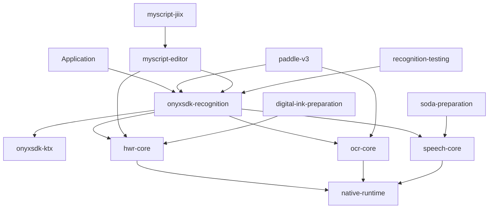

# Unified recognition platform implementation plan

<!-- markdownlint-disable MD013 MD024 MD033 MD060 -->

## Document status

This is the authoritative implementation blueprint for the Onyx recognition platform.
It supersedes the
[legacy recognition proposal](../RECOGNITION_MODULE_IMPLEMENTATION_PLAN_LEGACY.md).
It is intentionally a plan rather than an implementation: none of the artifacts,
permissions, providers, models, or APIs described here exist merely because this
document exists.

The words **must**, **must not**, **required**, **should**, and **may** are normative.
Where this document shows Kotlin, names may receive mechanical corrections for
compilation, but the ownership, lifecycle, failure, and compatibility contracts must
not change without revising the applicable ADR.

The plan assumes that licensing and redistribution questions have already been
resolved. It targets ordinary third-party Android applications, without system UID,
signature permissions, root, hidden-service bypasses, or a privileged BOOX Binder
provider.

Canonical domain terms are defined in the root
[recognition context](../CONTEXT.md). The hard-to-reverse decisions behind this plan
are:

- [native runtime isolation](adr/0001-isolate-recognition-native-runtimes.md);
- [public provider SPI and identity](adr/0002-version-the-public-recognition-provider-spi.md);
- [resource trust and lifecycle](adr/0003-use-host-sourced-versioned-resource-packs.md);
- [recognition concurrency](adr/0004-serialize-hwr-and-ocr-separate-speech.md);
- [raw diagnostics ownership](adr/0005-make-raw-diagnostics-host-controlled.md); and
- [revision and cache identity](adr/0006-identify-output-with-recognition-revisions.md).

## Goals and boundaries

The recognition platform provides one Kotlin-first entry point for three local
pipelines:

1. vector ink to handwriting results;
2. pixels to structured OCR results; and
3. microphone or injected PCM audio to speech transcripts.

The platform must:

- keep application-facing APIs immutable, coroutine-native, and provider-neutral;
- isolate native/runtime dependencies in narrowly owned core AARs;
- preserve actual provider, model, transformation, and compute provenance;
- make model/resource readiness and validation observable;
- operate without network fallback;
- allow third-party provider factories through a stable typed SPI;
- expose optional raw diagnostics only under one immutable process-wide policy; and
- reproduce the discovered firmware/notate capabilities through supported local
  engines instead of calling a privileged BOOX recognition service.

The following are explicitly out of scope:

- BOOX `IHWRService` or other firmware Binder recognition;
- cloud or hybrid fallback for handwriting, OCR, or speech;
- privileged/system-UID behavior;
- Paddle rasterized-stroke handwriting;
- Bengali OCR expansion;
- Qualcomm hotword or voice-activation integration;
- ink search, indexing, or ranking;
- an Android input method or keyboard handwriting UI;
- persistence or synchronization of recognition results;
- camera capture, PDF rendering, note editing UI, or model training; and
- a stable serialization format for the common Kotlin result models.

## Evidence baseline and provider identity

The underlying firmware evidence is recorded in
[Recognition firmware evidence](RECOGNITION_FIRMWARE_EVIDENCE.md). That document is
evidence for behavior and nomenclature, not a source of redistributable code or model
assets.

Firmware labels are aliases only. Public APIs, provenance, diagnostics, resources,
cache keys, and tests use these stable provider IDs:

| Pipeline | Actual provider | Stable provider ID | Firmware alias |
| --- | --- | --- | --- |
| HWR | MyScript iink 4.x | `myscript-iink-v4` | `MyScript` |
| HWR | Google ML Kit Digital Ink | `google-mlkit-digital-ink-v1` | built-in / `GoogleML` |
| OCR | Google ML Kit Text Recognition v2 | `google-mlkit-text-recognition-v2` | `ONYX_OFFLINE` |
| OCR | PaddleOCR September 2020 `ocr_v1_for_cpu` | `paddleocr-v1-2020` | `PADDLE` |
| OCR | PP-OCRv3 | `paddleocr-v3` | none |
| Speech | Google on-device SODA path | `google-soda-v1` | SODA |

A custom provider ID must be a unique 3–96 character lowercase ASCII slug:

- the first character is `a` through `z`;
- remaining characters are lowercase letters, digits, or single hyphens separating
  non-empty segments; and
- one segment is `v` followed by a positive base-10 integer.

IDs are generation identifiers, not dependency versions. Patch-level engine, model,
dictionary, and SDK versions belong in `RecognitionRevision`, not in the provider ID.
Changing a provider generation requires a new ID.

## Artifact topology

All recognition publications use the existing group
`io.github.hbmartin.onyx`, release in lockstep, and are constrained by
`onyxsdk-recognition-bom`.

| Artifact | Responsibility | May package `.so` |
| --- | --- | --- |
| `onyxsdk-recognition` | Kotlin facade, normalized models, routing, concurrency, diagnostics, and public SPI | No |
| `onyxsdk-recognition-native-runtime` | The single compatible C++ shared runtime used by vendor binaries | Yes |
| `onyxsdk-recognition-hwr-core` | MyScript and Digital Ink runtime boundaries plus minimal HWR core contracts | Yes |
| `onyxsdk-recognition-ocr-core` | ML Kit, Paddle Lite, OpenCV, bounded tile inference, and minimal OCR core contracts | Yes |
| `onyxsdk-recognition-speech-core` | Android on-device speech/SODA boundary and minimal speech core contracts | Yes |
| `onyxsdk-recognition-paddle-v3` | Optional PP-OCRv3 provider factory, profile, and resource definitions | No |
| `onyxsdk-recognition-myscript-editor` | Optional MyScript editing sessions and editing commands | No |
| `onyxsdk-recognition-myscript-jiix` | Optional JIIX validation/import/export | No |
| `onyxsdk-recognition-digital-ink-preparation` | Explicit Google Digital Ink model preparation | No |
| `onyxsdk-recognition-soda-preparation` | Explicit SODA language-model preparation | No |
| `onyxsdk-recognition-testing` | Fake providers, deterministic fixtures, and provider conformance suites | No |
| `onyxsdk-recognition-bom` | Lockstep dependency constraints | Not an AAR |



The facade depends on all three pipeline cores. Optional factories are registered
explicitly at initialization; the facade does not depend back on optional modules.
No recovered compatibility module gains a dependency on recognition.

### Native ownership

All repository-owned native bridge, preprocessing, geometry, validation, and
postprocessing source must be Rust. Owned C or C++ source and owned C/C++ ABI shims are
forbidden. Licensed vendor libraries may remain native binaries.

`onyxsdk-recognition-native-runtime` alone packages the ARM64
`libc++_shared.so` from Android NDK `28.2.13676358`. The three pipeline cores depend on
that artifact and must strip/exclude vendor copies of the same soname. Publication
must inspect every ELF dependency and required symbol version, reject duplicate
copies, and reject a vendor binary incompatible with the pinned runtime.

Recognition supports:

| Constraint | Value |
| --- | --- |
| Android minimum SDK | 26 |
| Published ABI | `arm64-v8a` only |
| Rust toolchain | Repository-pinned toolchain |
| C++ shared runtime | NDK `28.2.13676358` canonical copy |
| Application JVM/toolchain | Existing repository convention |

OCR uses the official Paddle Lite 2.10 Java/JNI distribution for both Paddle provider
generations. Onyx-owned notate orchestration, contour/Clipper-equivalent logic, and
postprocessing move to Rust/Kotlin. Image primitives use the vendor OpenCV Java/JNI
API; no Onyx C++ calls the OpenCV or Paddle C++ object ABI. Both Paddle providers must
pass their independent parity gates before publication.

## Public Kotlin conventions

Public APIs live under `com.onyx.android.sdk.recognition` and its `.hwr`, `.ocr`,
`.speech`, `.resources`, `.provider`, `.diagnostics`, `.model`, and optional-extension
subpackages.

The public surface is Kotlin-only:

- suspending operations return Kotlin `Result<T>`;
- `CancellationException` is never wrapped;
- unexpected provider throwables become `RecognitionFailure.ProviderBug`;
- immutable value constructors use `require` and throw `IllegalArgumentException` for
  malformed values;
- operation precondition violations may throw `IllegalArgumentException` or
  `IllegalStateException`;
- readiness, resource, provider, timeout, execution, and no-match outcomes are typed
  `RecognitionFailure` values inside `Result`;
- mutable Android geometry and primitive arrays do not appear in result contracts;
- lists and byte inputs are defensively copied where ownership says snapshot/copy;
- Kotlin `Duration` expresses optional timeouts; and
- common results are not `kotlinx.serialization` wire contracts.

All public declarations in every artifact require KDoc and a checked binary API dump
from the first `0.x` release.

## Bootstrap and runtime

The public bootstrap shape is:

```kotlin
object RecognitionSdk {
    fun initialize(
        application: Application,
        configuration: RecognitionConfiguration,
    ): Result<RecognitionRuntime>
}

data class RecognitionConfiguration(
    val handwritingProviders: List<HandwritingProviderFactory> = emptyList(),
    val ocrProviders: List<OcrProviderFactory> = emptyList(),
    val speechProviders: List<SpeechProviderFactory> = emptyList(),
    val disabledBundledProviders: Set<ProviderId> = emptySet(),
    val diagnostics: RecognitionDiagnosticsConfiguration =
        RecognitionDiagnosticsConfiguration(),
)

interface RecognitionRuntime {
    val capabilities: StateFlow<RecognitionCapabilitySnapshot>
    val handwriting: HandwritingRecognizer
    val ocr: OcrRecognizer
    val speech: SpeechRecognizer
    val handwritingResources: HandwritingResources
    val ocrResources: OcrResources

    suspend fun awaitInitialDiscovery(): Result<RecognitionCapabilitySnapshot>
    suspend fun refreshCapabilities(): Result<RecognitionCapabilitySnapshot>
}
```

The exact code may use classes rather than interfaces where construction control
requires it, but these responsibilities are fixed.

Initialization:

1. validates IDs, duplicate registrations, SPI compatibility, disabled IDs, and
   diagnostics configuration;
2. captures `application.applicationContext`;
3. freezes registration and process-wide policies;
4. starts capability discovery asynchronously; and
5. returns the runtime without disk scanning or model loading on the caller thread.

Any second call in the process is rejected, even if the application and configuration
are identical. Calls made while the capability snapshot is `DISCOVERING` fail
`RecognitionFailure.NotReady`; they do not queue or implicitly wait. Hosts that need
readiness call `awaitInitialDiscovery()` or collect `capabilities`.

Bundled providers register unless their ID appears in
`disabledBundledProviders`. Disabled providers remain visible in capability output
with reason `DISABLED_BY_HOST`. Optional and third-party providers are supplied
through the typed factory lists. Provider initialization failure degrades only that
provider to `UNAVAILABLE`; it does not fail the entire runtime.

## Provider SPI

The facade publishes three independent factory families:

```kotlin
interface HandwritingProviderFactory : RecognitionProviderFactory {
    fun create(context: HandwritingProviderContext): Result<HandwritingProvider>
}

interface OcrProviderFactory : RecognitionProviderFactory {
    fun create(context: OcrProviderContext): Result<OcrProvider>
}

interface SpeechProviderFactory : RecognitionProviderFactory {
    fun create(context: SpeechProviderContext): Result<SpeechProvider>
}

interface RecognitionProviderFactory {
    val descriptor: RecognitionProviderDescriptor
    val compatibility: ProviderSpiCompatibility
}

data class ProviderSpiCompatibility(
    val major: Int,
    val minimumHostMinor: Int,
    val maximumHostMinor: Int,
)
```

Factories declare one SPI major and an inclusive host-minor range. Registration
rejects a major mismatch or a range that does not include the host minor. Additive SPI
features are negotiated through typed descriptor capabilities, not reflection or
optional method-name probing.

Provider methods return `Result<CoreResult>`. They must rethrow cancellation and must
not call cloud services. The facade catches undeclared throwables at the provider
boundary, records a content-safe diagnostic, and returns `ProviderBug`.

Descriptors contain only typed fields:

- provider ID and human-readable engine name;
- pipeline and supported content types;
- language/script and audio/image capability sets;
- input, point, pixel, tile, audio, and session limits;
- supported ownership/input forms;
- resource prerequisites and readiness evidence;
- compute backends that may be selected;
- SPI feature flags; and
- provider/runtime generation metadata.

String-keyed capability or result attribute maps are not permitted. Provider authors
use `onyxsdk-recognition-testing` to run the same lifecycle, cancellation, failure,
geometry, and revision conformance suites as bundled providers.

## Shared models, provenance, and revisions

### Spatial document

HWR and OCR return the same immutable normalized spatial document alongside their
pipeline-specific ergonomic result:

```text
RecognitionDocument
└── RecognitionNode
    ├── Page
    ├── Block
    ├── Line
    ├── Word
    ├── Symbol
    ├── MathExpression
    ├── Shape
    ├── DiagramNode
    ├── DiagramEdge
    ├── Gesture
    └── StrokeReference
```

Nodes are a sealed typed hierarchy. Each relevant node carries typed geometry,
language/script, optional provider-native confidence, and typed children or
relationships. The model must not expose `RectF`, mutable arrays, or generic
string-keyed attributes.

Speech uses a separate immutable `SpeechTranscript` with alternatives, segments,
tokens, optional time ranges, optional speaker labels, and provider-native
confidence. It is not forced into the spatial document.

### Geometry

Shared geometry uses immutable finite `Double` values and explicit coordinate-space
identifiers. An immutable six-value affine transform maps between compatible 2D
spaces.

- HWR always exposes geometry in original ink coordinates.
- If the caller supplies a document-logical transform, HWR also exposes logical
  geometry and the exact transform.
- OCR exposes raw-storage geometry, visually oriented geometry, and the transform
  between them.
- Encoded EXIF orientation and explicit plane rotation/mirroring are normalized before
  recognition and remain reproducible through the returned transform.
- OCR reading direction is an optional explicit override; otherwise it is derived
  from resolved locale/script and can be horizontal LTR, horizontal RTL, or vertical.

### Confidence

`RecognitionConfidence` contains a finite provider value and `ConfidenceKind`.
Kinds distinguish probability, log probability, unbounded score, rank-only evidence,
and provider-specific native score. The facade never normalizes values across
providers and exposes no global confidence threshold.

### Provenance and revision

Every successful result and every post-execution `NoMatch` failure contains:

- provider ID and actual engine/runtime version;
- exact resource, model, and dictionary identities/digests;
- resolved language/script and content type;
- preprocessing and postprocessing profile revisions;
- input/output coordinate transforms;
- routing decision;
- actual CPU/GPU/NNAPI/DSP/NPU backend;
- capability validation state used for selection; and
- a typed `RecognitionRevision`.

`RecognitionRevision` exposes typed components and a lowercase canonical SHA-256 cache
key. The digest input is a schema-versioned, length-prefixed canonical encoding of all
output-affecting components above. It does not include timings, diagnostic IDs, or
input content. Any change capable of changing output must change at least one revision
component.

## Handwriting recognition

### Inputs and sessions

HWR reuses `com.onyx.android.sdk.ktx.model.InkStroke`. At the API boundary the facade:

1. copies the stroke list and every `InkPoint` field;
2. validates finite coordinates and bounded counts;
3. ignores the caller-owned mutable `RectF`;
4. recomputes bounds from copied points; and
5. retains timestamps, pressure, tilt, sequence, and tool even when a provider does
   not consume all channels.

Provider descriptors report which channels they consume. Caller list order is stroke
order.

```kotlin
data class HandwritingSessionOptions(
    val providerId: ProviderId,
    val contentType: HandwritingContentType,
    val languages: List<LanguageTag> = emptyList(),
    val documentTransform: AffineTransform? = null,
)

interface HandwritingRecognizer {
    suspend fun openSession(
        options: HandwritingSessionOptions,
    ): Result<HandwritingSession>

    suspend fun recognize(
        strokes: List<InkStroke>,
        options: HandwritingSessionOptions,
        timeout: Duration? = null,
    ): Result<HandwritingResult>
}

interface HandwritingSession : AutoCloseable {
    val state: StateFlow<HandwritingSessionState>

    suspend fun recognize(
        strokes: List<InkStroke>,
        timeout: Duration? = null,
    ): Result<HandwritingResult>

    override fun close()
    suspend fun closeAndAwait(): Result<Unit>
}
```

`providerId` is mandatory; HWR never automatically selects or falls back to another
provider. An empty language list resolves the current application locale list at
session creation. The provider validates the resolved language combination.

The session pins provider, content type, resolved languages, options, validation
state, and resource revision. It owns no accumulated strokes. Each `recognize` call
supplies the complete immutable ink snapshot. Interactive accumulation and mutation
belong to the editor module.

### Content and results

`HandwritingContentType` contains:

- `TEXT`;
- `MATH`;
- `DIAGRAM`;
- `SHAPE`;
- `RAW_CONTENT`;
- `GESTURE`; and
- `MIXED`.

`HandwritingResult` is sealed with a typed subtype for each content family. Every
subtype exposes the normalized `RecognitionDocument`, revision, and provenance.
Provider-specific classes never leak.

Valid input that yields no acceptable recognition returns
`Result.failure(RecognitionFailure.NoMatch(...))`, including the attempt revision and
provenance. It is not an empty success.

### MyScript extensions

The common HWR API does not expose MyScript editing modes. The optional editor module
owns:

- on-screen, off-screen, and contextless sessions;
- import and replacement;
- erasing and gesture application;
- undo and redo;
- editing state and change events; and
- conversion between editor state and common HWR results.

The JIIX module exposes an immutable `JiixDocument` that:

- holds canonical JSON losslessly;
- validates supported schema and content-type invariants;
- exposes typed schema version, content type, and provenance;
- preserves unknown fields during round trips; and
- imports/exports without exposing MyScript SDK classes.

JIIX is the only standardized persistence/interchange representation in this plan.

## Optical character recognition

### Ownership-explicit input

`OcrInput` is sealed and names retention in the type:

- `CopiedBitmap`;
- `SnapshotImagePlanes`;
- `BorrowedImagePlanesUntilComplete`;
- `SnapshotReadOnlyBuffer`;
- `BorrowedReadOnlyBufferUntilComplete`; and
- `CopiedEncodedBytes`.

Snapshot variants copy before entering the FIFO and retain no caller object.
Borrow-until-completion variants avoid that copy; callers must keep every plane,
buffer, and backing allocation open and unchanged until the result returns. Encoded
bytes and bitmap pixels are always copied. There is no ambiguous retention flag and
no file-path or URL input.

All inputs carry explicit dimensions, strides, pixel format, rotation, mirroring, and
raw coordinate space where applicable. Provider limits and facade hard limits reject
invalid or excessive input before native inference.

### Routing and preprocessing

```kotlin
sealed interface OcrRoutingPolicy {
    data object Auto : OcrRoutingPolicy
    data class Provider(val providerId: ProviderId) : OcrRoutingPolicy
}

enum class OcrPreprocessingPolicy {
    PROVIDER_DEFAULT,
    NONE,
}

data class OcrRequest(
    val input: OcrInput,
    val routing: OcrRoutingPolicy,
    val languageHints: List<LanguageTag> = emptyList(),
    val writingDirection: WritingDirection? = null,
    val preprocessing: OcrPreprocessingPolicy,
    val timeout: Duration? = null,
)
```

`Auto`:

1. resolves ordered caller language hints or the current application locale list;
2. derives scripts;
3. considers only `VALIDATED` installed capabilities;
4. selects ML Kit first for a validated supported script;
5. selects a Paddle provider only when the resolved script is unsupported by validated
   ML Kit capability; and
6. records the complete routing decision in provenance and revision.

Auto never fans out across models and never uses an `UNVERIFIED` capability. Explicit
provider routing never falls back. Explicit selection may run an unverified
provider/resource and records that status.

The facade owns:

- bounded decoding;
- EXIF/orientation normalization;
- provider-profile preprocessing;
- tiling and bounded tile scheduling;
- coordinate restoration;
- overlap deduplication;
- page hierarchy construction;
- reading order; and
- writing-direction resolution.

Pipeline cores recognize bounded tiles/regions only. Tiling constants and provider
tuning remain versioned implementation profiles, not public knobs. `NONE` bypasses
optional preprocessing but not safety validation or coordinate normalization.

Paddle v1-2020 and v3 remain distinct provider IDs and resource revisions. The
optional v3 artifact depends on OCR core and contains no native library. Rasterizing
ink into Paddle OCR is not an HWR provider and is excluded.

## Speech recognition

Speech is on-device only and defaults to `google-soda-v1`. Callers may explicitly
select another registered speech provider; default selection does not fall back if
SODA is unavailable.

```kotlin
sealed interface SpeechAudioSource {
    data object Microphone : SpeechAudioSource
}

sealed interface InjectedSpeechAudioSource : SpeechAudioSource {
    data class PcmStream(
        val format: PcmFormat,
        val chunks: Flow<PcmChunk>,
    ) : InjectedSpeechAudioSource

    data class Descriptor(
        val descriptor: ParcelFileDescriptor,
        val format: PcmFormat,
        val ownership: DescriptorOwnership,
    ) : InjectedSpeechAudioSource
}

enum class DescriptorOwnership {
    DUPLICATE_AND_BORROW_ORIGINAL,
    TRANSFER_TO_SDK,
}

data class SpeechSessionOptions(
    val providerId: ProviderId = ProviderIds.GOOGLE_SODA_V1,
    val language: LanguageTag? = null,
    val audio: SpeechAudioSource,
    val timeout: Duration? = null,
)

data class InjectedSpeechOptions(
    val providerId: ProviderId = ProviderIds.GOOGLE_SODA_V1,
    val language: LanguageTag? = null,
    val timeout: Duration? = null,
)

interface SpeechRecognizer {
    suspend fun openSession(
        options: SpeechSessionOptions,
    ): Result<SpeechSession>

    suspend fun recognizeInjectedAudio(
        audio: InjectedSpeechAudioSource,
        options: InjectedSpeechOptions = InjectedSpeechOptions(),
    ): Result<SpeechTranscript>
}

interface SpeechSession : AutoCloseable {
    val state: StateFlow<SpeechSessionState>
    val events: Flow<SpeechEvent>

    override fun close()
    suspend fun closeAndAwait(): Result<Unit>
}
```

`PcmChunk` copies its bytes and is immutable. `PcmFormat` states sample rate, channels,
and Android PCM encoding. Provider descriptors state accepted formats and source
forms. For duplicate ownership the SDK duplicates the descriptor synchronously and
owns only the duplicate; for transfer ownership it closes the supplied descriptor on
every terminal path.

An absent language resolves the first supported current application locale when the
session opens. The locale and model revision remain pinned for the session.

The speech core uses
`SpeechRecognizer.createOnDeviceSpeechRecognizer` where available. Microphone
on-device speech requires API 31. Injected audio is capability-probed and requires the
API 33 audio-source path for the bundled provider. The facade manifest declares
`RECORD_AUDIO` and recognition-service visibility, but not `INTERNET`. The library
does not request runtime permission; missing permission is a typed failure.

Speech owns an independent process-wide lane. Opening a second session while one is
active fails immediately with `RecognitionFailure.SpeechBusy`. It never queues or
preempts. Session events cover readiness, listening/consuming audio, partial
transcript, final transcript, and terminal failure. Partial event segmentation is not
a stable parity contract.

## Concurrency, cancellation, and lifecycle

HWR and OCR share one process-wide actor and one native-execution lane:

| Property | Contract |
| --- | --- |
| Active recognition | One HWR or OCR request |
| Pending recognition | Eight requests maximum |
| Ordering | Strict FIFO across HWR and OCR |
| Overflow | Ninth pending request fails `QueueFull` |
| Control capacity | One additional reserved resource-activation command |
| Queued cancellation | Removes the request without reordering remaining work |
| Running cancellation | Caller receives cancellation immediately; native call continues, result is discarded |
| Optional timeout | Covers discovery-independent queue wait plus execution |
| Default timeout | None |

Native inference is not assumed interruptible. After a running caller is cancelled or
times out, its lane remains occupied until the provider returns. A timeout cannot
claim that native work was terminated.

Resource activation becomes a FIFO control command when verification completes. It
runs after already accepted work and before later work. The reserved control slot
prevents a full eight-request queue from starving activation. Multiple control
operations preserve their own acceptance order.

`close()` is idempotent and initiates non-blocking shutdown. `closeAndAwait()` waits for
the provider and pinned resources to release and returns a typed result. Closing a
session fails its queued operations with `SessionClosed`; already-running native work
uses discard-after-return. All later session calls fail `SessionClosed`.

## Resource packs and preparation

### Pack source and format

`HandwritingResources` and `OcrResources` expose the same installation contract.
Speech system-model readiness is exposed through capability state and the SODA
preparation module rather than the ZIP manager.

```kotlin
sealed interface ResourcePackSource {
    data class FileSource(val file: File) : ResourcePackSource
    data class ContentUri(val uri: Uri) : ResourcePackSource
    data class Stream(val input: InputStream) : ResourcePackSource
}

enum class ActivationPolicy {
    PREPARE_ONLY,
    ACTIVATE_AFTER_VERIFY,
}

interface ResourceInstallOperation : AutoCloseable {
    val progress: StateFlow<ResourceInstallProgress>
    suspend fun await(): Result<InstalledResourcePack>
    override fun close()
}
```

The SDK opens/closes file and URI streams and always closes a caller-supplied
`InputStream`. There is no pack `ByteArray` overload.

`await()` is idempotent: every call observes the same terminal result.

Packs are ZIP archives with root `manifest.json` encoded as RFC 8785 canonical JSON.
The versioned manifest contains:

- schema version;
- resource slot, pack ID, revision, provider generation, and content/languages;
- required ABI, minimum Android API, and provider/runtime compatibility;
- normalized relative payload paths;
- exact uncompressed length and lowercase SHA-256 for every payload;
- model/dictionary roles and revisions; and
- provider-specific typed compatibility data defined by a versioned core schema.

Archives must reject absolute paths, `..`, duplicate normalized paths, symlinks,
special files, encrypted entries, undeclared entries, length mismatches, and hash
mismatches.

Global ceilings are:

| Limit | Value |
| --- | ---: |
| Manifest | 1 MiB |
| Entries | 4,096 |
| One uncompressed file | 2 GiB |
| Total expanded data | 4 GiB |
| Expansion ratio | 100:1 |

Providers may publish tighter limits but cannot raise these ceilings. The installer
checks declared totals and available app-private storage before extraction, then
enforces actual streamed bytes.

Manifest hashes detect corruption only. Because the manifest authenticates itself,
they do not prove publisher identity. The host is responsible for obtaining packs
from a trusted source; this limitation must appear in KDoc and the resource ADR.

### Installation and retention

Every install call supplies an explicit activation policy; there is no default.
Progress covers source transfer, manifest validation, extraction, hashing,
compatibility, verification, activation wait, readiness check, commit, rollback, and
terminal state.

Staging and hashing run off the recognition lane. Activation, rollback, and engine
reload run on the shared control lane.

Per provider/resource slot the manager retains at most:

1. the active verified revision;
2. the previous verified rollback revision; and
3. one inactive prepared candidate.

A newer prepared candidate replaces the older inactive candidate after all pins on
the older candidate are released. Active, previous, or session-pinned revisions
cannot be removed; removal returns `ResourceInUse`.

Activation is atomic:

1. pin the previous active revision;
2. load and health-check the candidate;
3. commit the active pointer only after readiness succeeds;
4. retain the old active as previous; or
5. preserve/restore the old active and quarantine the candidate on failure.

Post-commit inference failures never trigger automatic rollback. The host calls an
explicit rollback operation.

Closing/cancelling an install:

- deletes incomplete or unverified staging;
- after verification, cancels queued activation but retains the pack as the prepared
  candidate; and
- after activation begins, waits for atomic commit or rollback rather than interrupting
  the transition.

Every phase is journaled in app-private storage with atomic writes and fsync
boundaries. On startup the manager re-verifies interrupted staging and resumes the
recorded `PREPARE_ONLY` or `ACTIVATE_AFTER_VERIFY` policy. Failed recovery keeps the
last committed active revision and emits a typed diagnostic.

### Capability validation

Each exact provider/resource revision is:

- `VALIDATED`: eligible for automatic routing;
- `UNVERIFIED`: installed/available but executable only through explicit selection; or
- `UNAVAILABLE`: not executable, with a typed reason.

Exact bundled revisions that pass release corpus gates start validated. Unknown
caller packs start unverified. The host may call `markValidated(revision)` or
`markUnverified(revision)`; this boolean promotion/demotion is stored against the
exact revision with SDK storage metadata only. Demotion affects new automatic
selection immediately but does not alter already-pinned sessions.

### Preparation modules

Digital Ink and SODA preparation artifacts are network-facing and may declare
`INTERNET`. They expose only explicit host-started operation handles and progress.
They add no WorkManager, receiver, automatic background job, or retry policy. The host
owns scheduling and retry.

MyScript and Paddle packs remain caller-provisioned. The main facade and cores contain
no model URL or downloader and do not declare `INTERNET`.

## Diagnostics and privacy

`RecognitionDiagnosticsConfiguration` is immutable and frozen at initialization:

```kotlin
data class RecognitionDiagnosticsConfiguration(
    val rawPayloadsEnabled: Boolean = false,
    val sink: RecognitionDiagnosticSink? = null,
)
```

Metadata is emitted to the Android Logcat tag `OnyxRecognition` by default. It may
include operation/provider IDs, revisions, dimensions/counts, durations, queue state,
backend, state transitions, failure categories, diagnostic IDs, and drop counts. It
must not include ink coordinates, pixel/audio bytes, recognized text, JIIX, certificate
data, user vocabulary, private paths, or stable user/device identifiers.

A configured sink receives the same metadata on a dedicated diagnostics worker.
When `rawPayloadsEnabled` is true it may additionally receive typed, one-shot raw
payload objects/streams for:

- immutable ink snapshots;
- image snapshots or tee streams;
- PCM chunks/streams; and
- typed recognition output.

The SDK defines no byte serialization for raw attachments. The host chooses whether
and how to encode or persist them, and the SDK keeps no long-term raw-data store.
With raw logging enabled but no sink, Logcat receives only non-content summaries and
cryptographic hashes, never the raw payload.

Diagnostics never backpressure or fail recognition. Fixed worker budgets are:

| Budget | Value |
| --- | ---: |
| Pending metadata events | 256 |
| Pending raw attachments | 4 |
| Retained raw bytes/references | 64 MiB |

When pressure exceeds a budget, drop raw attachments first and then metadata. The next
delivered metadata event includes monotonic counts for every dropped category.
Sink exceptions are contained and reported through content-safe Logcat metadata.

Raw diagnostics are permitted in release builds. There is no per-call consent token.
Every related API KDoc must warn that the host owns user consent, disclosure, access
control, transport, retention, deletion, and regulatory compliance.

## KDoc and API compatibility requirements

The existing Dokka policy (`reportUndocumented=true`, `failOnWarning=true`) applies to
every new public artifact. KDoc must document:

- ownership, copying, borrowing, mutation, and closure;
- permitted threads and internal dispatcher movement;
- cancellation before and after native entry;
- optional timeout boundaries;
- queue capacity and ordering;
- coordinate spaces and transforms;
- resource and capability prerequisites;
- provider IDs, actual engines, and firmware aliases;
- result revision and cache-key semantics;
- every thrown programming exception and typed operational failure;
- session state and closure;
- raw diagnostics privacy/retention responsibility; and
- API-level, ABI, permission, and offline constraints.

Major workflows use compile-checked `@sample` functions:

1. initialize and await capabilities;
2. explicit HWR one-shot and pinned session;
3. OCR Auto and explicit-provider requests with both retention modes;
4. microphone and injected-audio speech;
5. prepare/install/activate/rollback a resource pack;
6. register and test a custom provider; and
7. configure metadata-only and raw diagnostic sinks.

Kotlin binary-compatibility validation and checked API dumps begin at `0.1`. All
intentional public changes require reviewed dump updates. Public SPI stability is not
deferred until `1.0`.

## Verification

### Test layers

| Layer | Required coverage |
| --- | --- |
| Pure unit tests | IDs, models, transforms, routing, ordering, revisions, manifests, ZIP limits, retention, journals, and diagnostics |
| Provider TCK | HWR/OCR/speech factory compatibility, readiness, failures, cancellation, limits, geometry, and revisions |
| Rust tests/fuzzing | Pack parsing helpers, custom geometry, Paddle postprocessing, malformed provider buffers, and JNI validation |
| Instrumentation | Vendor loading, permissions, model readiness, audio ownership, process recreation, low storage/memory, and offline behavior |
| Differential corpus | Provider parity using the rules below |
| Device validation | API 26, API 31 speech, Note Air4 C API 33, and API 35 |
| Publication audit | ABI/sonames, canonical `libc++`, duplicate JNI, licenses, provenance, API dumps, KDoc, and manifest permissions |

Fixtures must be synthetic, public, or redistribution-compatible and contain no
private notes, firmware user data, extracted proprietary test data, certificates, or
model assets.

### Differential rules

The corpus is rolling rather than an immutable snapshot set. Provider rules are
manually reviewed and versioned. Changing a rule changes the relevant recognition
revision.

| Provider | Required parity |
| --- | --- |
| All | Normalized semantic text, structure, and order exact where applicable |
| ML Kit OCR | Geometry delta `≤ max(2 px, 0.25% of dimension)`; native confidence delta `≤ 0.01` |
| Paddle v1/v3 | Geometry delta `≤ max(3 px, 0.5% of dimension)`; IoU `≥ 0.98`; confidence delta `≤ 0.02` |
| MyScript | Semantic content and candidate order exact; geometry delta `≤ 0.5%` of logical dimension; confidence delta `≤ 0.02` |
| Digital Ink | Ordered candidates, gesture labels, and shape labels exact |
| SODA | Normalized final transcript and alternative order exact; token timing `±100 ms`; confidence delta `≤ 0.02`; partial segmentation ignored |

Provider-specific normalization rules must be explicit and content-preserving. They
may normalize Unicode representation and documented whitespace but may not hide a
word, candidate, node, label, or ordering mismatch.

Performance is measured and published but is not a release threshold. Crashes,
deadlocks, native hangs observed by the test timeout, leaks, unbounded growth,
incompatible ABI, content leakage, and resource corruption are correctness failures
and block release.

### Device gate

`1.0` requires:

1. generic ARM64 API 26 for minSdk behavior and native loading;
2. ARM64 API 31 for microphone on-device speech;
3. Note Air4 C API 33 for all pipelines and injected audio; and
4. the repository compile-SDK API 35 emulator for current-platform behavior.

A provider-dependent case may report a typed unavailable capability only when that
unavailability is itself the expected assertion. Tests must not silently skip.

## Delivery milestones

All published recognition artifacts use the same version at each release.

### 0.1 — contracts and platform foundation

- artifact/BOM scaffolding and dependency boundaries;
- native-runtime ownership and ELF verification;
- public Kotlin models, bootstrap, three SPIs, fake providers, and testing artifact;
- FIFO/session/cancellation infrastructure;
- resource pack schema, installer, journaling, and validation;
- diagnostics and revision infrastructure;
- KDoc samples and checked API dumps.

This release may contain no production-ready recognition provider.

### 0.2 — joint OCR and HWR milestone

The release is publishable only when all five base providers pass their applicable
resource, corpus, offline, and device gates:

- ML Kit Text Recognition v2;
- PaddleOCR v1-2020;
- PP-OCRv3;
- MyScript iink v4; and
- ML Kit Digital Ink v1.

Digital Ink preparation ships in this milestone. OCR and HWR are a joint gate; neither
is declared ready while the other is incomplete.

### 0.3 — MyScript editing and JIIX

- editor modes and mutation commands;
- close/undo/redo and state-machine tests;
- lossless validated JIIX import/export;
- editor-to-common-result mapping; and
- licensed lifecycle and round-trip gates.

### 0.4 — on-device speech

- SODA provider and speech session/event APIs;
- microphone and both injected-audio forms;
- API 31/API 33 capability behavior;
- SODA preparation operation; and
- permission, ownership, no-cloud, and speech parity tests.

### 0.5 — hardening

- complete discovered language/resource paths;
- validation-state and host-promotion coverage;
- crash recovery, rollback, low-storage, and process-recreation gates;
- full device matrix;
- long-run/leak/fuzzing results; and
- publication, provenance, KDoc, and API compatibility cleanup.

Not every discovered locale must be validated to publish. Untested installed locales
remain `UNVERIFIED` and require explicit selection.

### 1.0 — stable platform

`1.0` freezes the facade API, provider SPI major, core bridge contracts, resource-pack
schema, revision schema, provider IDs, KDoc behavior, and device gates after every
blocking verification item passes.

## Non-blocking notate migration appendix

The notate repository at commit
`3319a6451eff6004c2c39689cf3119e39d48debc` is the behavioral source for PP-OCRv3
rasterization, tiling, coordinate restoration, overlap deduplication, reading order,
resource lifecycle, and tests.

Migrating notate is not an Onyx milestone or release gate. A later notate-specific
plan may:

1. replace its direct `:ocr-runtime` use with the Onyx facade and optional Paddle v3
   factory;
2. map notate strokes/pages to ownership-explicit OCR inputs;
3. preserve product-owned indexing, WorkManager scheduling, settings, and insertion
   policy;
4. compare old/new output with the Paddle v3 differential rules; and
5. remove the old runtime only after end-to-end app acceptance.

No implementation phase in this plan edits `/Volumes/ExtStor/notate`.

## External API references

- [MyScript iink Android getting started](https://developer.myscript.com/doc/interactive-ink/4.1/android/fundamentals/get-started/)
- [MyScript recognition content types](https://developer.myscript.com/docs/interactive-ink/latest/concepts/content-types/)
- [MyScript recognition resources](https://developer.myscript.com/docs/interactive-ink/4.3/android/advanced/custom-recognition/)
- [ML Kit Digital Ink Recognition](https://developers.google.com/ml-kit/vision/digital-ink-recognition/android)
- [ML Kit Text Recognition v2](https://developers.google.com/ml-kit/vision/text-recognition/v2/android)
- [Android `SpeechRecognizer`](https://developer.android.com/reference/android/speech/SpeechRecognizer)
- [Android `RecognizerIntent`](https://developer.android.com/reference/android/speech/RecognizerIntent)
- [PaddleOCR Android Lite deployment](https://github.com/PaddlePaddle/PaddleOCR/blob/main/deploy/lite/readme.md)

<!-- markdownlint-enable MD013 MD024 MD033 MD060 -->
